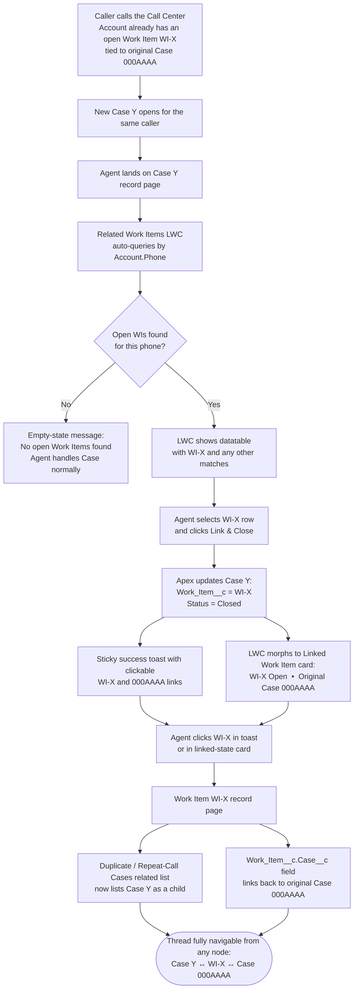

# Duplicate Work Item Detection — Implementation Plan

## Goal

When a caller reaches a Call Center Agent about an issue they've already contacted us about, the agent should be able to:

1. See any **open Work Items** that belong to the caller (matched by phone number), right on the new Case record page.
2. Select the correct existing Work Item.
3. **Link and close** the new Case against that Work Item in one click — so the Work Item holds the thread and the new Case becomes one of its duplicate/repeat-call child Cases.

No new channel integration, no phone normalization, no new custom objects. Just a small LWC + a thin Apex controller + one new lookup field on Case, styled with out-of-the-box SLDS.

## Data model (what the "parent / child" relationship actually looks like)

The existing `dcca-devcc` org already has this relationship (used for the **first** Case that creates a Work Item):

```
Case (parent)  ──1:1──►  Work_Item__c.Case__c
```

`Work_Item__c.Case__c` is the lookup that points at the Case that originated the Work Item. Only **one** Case lives on that lookup.

This plan adds a **second** relationship, going the other direction, so repeat-call Cases can attach to an existing Work Item without overwriting the original parent:

```
                                 ┌──► Case (child)  ── Case.Work_Item__c ──┐
Case (parent) ──► Work_Item__c ──┤                                         │
                                 └──► Case (child)  ── Case.Work_Item__c ──┘
```

- `Work_Item__c.Case__c`  → the **original** Case that spawned the Work Item (unchanged).
- `Case.Work_Item__c` (NEW) → lets **repeat-call Cases** point up at the Work Item.

How we tell the parent from the children:

- The **parent Case** = whichever Case the Work Item points to via `Work_Item__c.Case__c`.
- **Child Cases** = every Case where `Case.Work_Item__c = <that Work Item>`.

## Scope

### What's being built

| # | Item | Type | Status in dcca-devcc |
|---|------|------|----------------------|
| 1 | `Case.Work_Item__c` (Lookup → `Work_Item__c`) | Custom Field | **New** |
| 2 | `WI_DuplicateDetectionController` | Apex Class | **New** |
| 3 | `WI_DuplicateDetectionController_Test` | Apex Test | **New** (100% coverage, 100% pass) |
| 4 | `wi_duplicateWorkItemDetector` | LWC bundle | **New** (html, js, js-meta.xml) |
| 5 | `UJET_Agent` permission set | Modified | Extended with class access + field access |

### Out of scope / left to admin

- Dropping the LWC onto the `PVL_Case` flexipage right sidebar.
- Adding the "Duplicate / Repeat-Call Cases" related list to Work Item page layouts.
- Assigning `UJET_Agent` to new users (already assigned to the 20 existing Call Center Agents).

## Live dcca-devcc validation (checked before building)

- `Work_Item__c` already exists with `Case__c` lookup and `High_Priority__c` (required Boolean). Status picklist: `New`, `In-Progress`, `Transferred`, `Closed`.
- `Case.Status` picklist includes `Closed`.
- Case validation rules reviewed:
  - Most have a `Status = 'Closed'` exemption and won't block the close.
  - `Call_Center_Force_Island_for_OCP_Cases`, `Call_Center_Force_Branch_for_INS_Cases`, `Call_Center_Force_Branch_for_BREG_Cases` do **not** exempt `Closed` — if the required field is missing, the Apex `Database.update(..., USER_MODE)` will fail and we surface the message via `AuraHandledException` → error toast on the LWC, so the agent fills the field and retries.
- `UJET_Agent` is an unmanaged Permission Set labeled "Call Center Agent", with 20 users assigned.

## Component design

### 1. Case field: `Case.Work_Item__c`

```xml
<fullName>Work_Item__c</fullName>
<label>Work Item</label>
<type>Lookup</type>
<referenceTo>Work_Item__c</referenceTo>
<relationshipName>Duplicate_Cases</relationshipName>
<relationshipLabel>Duplicate / Repeat-Call Cases</relationshipLabel>
<deleteConstraint>SetNull</deleteConstraint>
```

The `relationshipLabel` is what appears as the related list title on the Work Item page — deliberately named so agents know these aren't "Cases that originated this Work Item" but repeat-call duplicates.

### 2. Apex controller: `WI_DuplicateDetectionController`

Two `@AuraEnabled` methods, direct SOQL, `WITH USER_MODE` / `AccessLevel.USER_MODE`:

- `getRelatedWorkItems(Id caseId)` — `cacheable=true`
  1. Load current Case's `AccountId` + `Account.Phone`.
  2. Find all Accounts with the same `Phone`.
  3. Return any `Work_Item__c` where `Case__r.AccountId` ∈ those Accounts, excluding the current Case, excluding `Status__c = 'Closed'` WIs, excluding WIs whose parent Case is already Closed. Ordered by `CreatedDate DESC`, capped at 50.
  4. Returns empty list gracefully for: null caseId, Case not found, no Account, blank Phone, no sibling WIs.

- `linkAndClose(Id caseId, Id workItemId)`
  1. `Database.update(new Case(Id=caseId, Work_Item__c=workItemId, Status='Closed'), AccessLevel.USER_MODE)`.
  2. On `DmlException` (validation rule failure, FLS, etc.), surface the first DML message via `AuraHandledException`.
  3. Returns the linked Work Item's auto-number Name for the success toast.

A `WorkItemResult` wrapper class exposes a stable shape to the LWC (Work Item URL/number, division, status, parent Case URL/number, high-priority flag, created date).

### 3. Test class: `WI_DuplicateDetectionController_Test`

**Result: 100% coverage, 100% pass.** 17 test methods covering:

- Happy path: sibling-account open WI returned, current-Case WIs excluded.
- Excludes: own WIs, closed WIs, closed parent Cases.
- Empty graceful: null caseId, nonexistent caseId, no Account, blank phone, no sibling Cases.
- Bulk: 60 WIs inserted, query caps at 50.
- `linkAndClose`: happy path (link + close), null inputs, invalid IDs, deleted WI, validation rule surfacing (PVL + OCP Case with no Island).
- FLS: minimum-access user gets graceful empty (exercises USER_MODE branch).
- `WorkItemResult` wrapper fallback: RecordType=null → uses `Transfer_to_Division__c`.

### 4. LWC: `wi_duplicateWorkItemDetector`

Pure out-of-the-box SLDS — `lightning-card`, `lightning-datatable`, `lightning-button`, `lightning-spinner`, `slds-dl_horizontal` — no custom CSS, matches every other record-page component visually. The datatable is wrapped in a `height: 12rem` container so the horizontal scrollbar always has room beneath the rows instead of overlapping them in narrow right-sidebar regions.

The component has **two states** driven by `Case.Work_Item__c`, using a `getRecord` wire that spans into the linked Work Item:

**a) Detection state** (`Case.Work_Item__c` is null)

Card title: **Related Work Items** · Refresh button in header.

1. Wired Apex call `getRelatedWorkItems({ caseId: recordId })`.
2. Render states: spinner → error text → "No open Work Items found" → datatable with single-row selection.
3. **Link & Close** button (brand style) enabled only when a row is selected.
4. On success: sticky success toast whose message contains clickable links to the linked Work Item and its original parent Case — built via `ShowToastEvent.messageData` with `url`/`label` entries. `getRecordNotifyChange` refreshes the record page, which also refreshes the `getRecord` wire and flips the LWC into its linked state.
5. On error: sticky error toast with the exception message (validation rule text is surfaced verbatim).
6. **Refresh** button in the card header manually re-runs the Apex wire — used after an agent corrects the Person Account's phone number and saves, to re-query with the new phone.

**b) Linked state** (`Case.Work_Item__c` is populated — appears after Link & Close, or on any previously-linked Case)

Card title: **Linked Work Item** · no Refresh button.

Renders a small definition-list card inside the same `lightning-card`:

| Work Item | WI-XXXXX (link) (Status) |
| Original Case | 000YYYYY (link) |

Both links are native anchor tags to `/Id`, so they open the record in the same console tab. This keeps one-click access to the Work Item (and two-click access to the original parent Case) persistent on the closed Case record page without requiring Dynamic Forms or a field drop on every flexipage.

The linked-state data is read client-side via `getRecord` using spanning fields:
- `Case.Work_Item__c`
- `Case.Work_Item__r.Name`
- `Case.Work_Item__r.Status__c`
- `Case.Work_Item__r.Case__c`
- `Case.Work_Item__r.Case__r.CaseNumber`

No new Apex, no new tests — the existing Call Center Agent FLS already covers `Work_Item__c.Case__c`, `Work_Item__c.Status__c`, and the standard `Case.CaseNumber` / `Work_Item__c.Name`.

`js-meta.xml` scopes the component to `lightning__RecordPage` on `Case` only.

### 5. Permission set: `UJET_Agent` (existing, extended)

Added:
- `<classAccesses>` entry for `WI_DuplicateDetectionController` (enabled).
- `<fieldPermissions>` entry for `Case.Work_Item__c` (readable + editable).

No new permission set, no new assignments — the 20 existing Call Center Agents automatically get access on redeploy.

## Deployment order (as executed in dcca-devcc)

1. Retrieve current `UJET_Agent` permset.
2. Deploy `Case.Work_Item__c` field.
3. Deploy Apex controller + test class; assign permset to self; run tests → 100% / 100%.
4. Deploy LWC (initial version — detection state only).
5. Redeploy `UJET_Agent` with class + field access.
6. Programmatically edit all 10 Case flexipages that have a right-column region to add the LWC, then deploy. (`Division_Default_Case_Layout` skipped — no right column.)
7. Redeploy LWC with **linked-state** enhancement: `getRecord` spans into `Case.Work_Item__r.*` to render a persistent "Linked Work Item" card on closed Cases, and `linkAndClose`'s success toast now includes clickable WI + Original Case links via `ShowToastEvent.messageData`. No Apex/test changes — existing UJET_Agent FLS already covers `Work_Item__c.Status__c` and `Work_Item__c.Case__c`.
8. (Admin, manual) Add "Duplicate / Repeat-Call Cases" related list to Work Item page layouts. Optional cleanup: reposition the LWC within each flexipage in Lightning App Builder to taste.

> Standalone field placement (e.g. adding the `Case.Work_Item__c` lookup directly to each flexipage as a `fieldInstance`) was evaluated and **rejected**. Lightning record pages only allow standalone fields inside `Facet` regions owned by `flexipage:fieldSection` components, which in turn require Dynamic Forms to be activated. Rather than activate Dynamic Forms for a single field, navigation to the linked Work Item is surfaced entirely through the LWC's linked-state card and the Link & Close toast, both of which use the existing `Case.Work_Item__c` lookup under the hood.

## How an agent uses it

1. Caller reaches the agent; the new Case opens on the appropriate Case flexipage (e.g. `PVL_Case`).
2. Right column: **Related Work Items** card.
   - Empty state: "No open Work Items were found for this caller's phone number." → agent proceeds normally.
   - Matches: table of open Work Items for that phone number, showing Work Item # (clickable), Division, Status, Parent Case # (clickable), High Priority, Created date.
3. If the agent corrects the phone number on the Person Account (Highlight Panel), they hit **Refresh** on the card to re-query with the new phone.
4. Agent picks the matching Work Item's row (radio-select), clicks **Link & Close**.
5. The new Case gets `Work_Item__c` set and `Status = 'Closed'`. A sticky success toast appears with clickable links to the Work Item and its original parent Case — one click takes the agent directly to either record.
6. The LWC card morphs into its **Linked Work Item** state, showing the Work Item and Original Case as persistent clickable links inside the same card. The agent (or anyone who revisits this closed Case later) retains one-click navigation back to the Work Item without having to add the lookup field to every flexipage.
7. If a validation rule blocks the close (e.g. PVL/OCP Case missing Island), the rule's user-facing message appears as an error toast so the agent fills the field and retries.

## User experience diagram

Demo walkthrough — follow this flow when showing the feature to the team.



### Key nodes in plain English

| Node | What the agent sees | What's happening in data |
|---|---|---|
| **D** | "Related Work Items" card in right column of Case Y | LWC reads `Case.AccountId` + `Account.Phone`, calls `getRelatedWorkItems` Apex |
| **G** | Datatable of WIs for the caller's phone | SOQL returns open WIs where `Case__r.AccountId` matches any Account with same phone |
| **I** | Loading spinner on the button | Apex `linkAndClose`: `Database.update(..., USER_MODE)` writes `Work_Item__c` + `Status='Closed'` |
| **J** | Sticky green toast with two clickable links | `ShowToastEvent.messageData` with `url`/`label` entries |
| **K** | Card title flips to "Linked Work Item", datatable is replaced by a two-row definition list | `getRecord` wire reads `Case.Work_Item__r.*` spans; the LWC renders its linked-state branch |
| **N** | Existing related list on Work Item's flexipage | Standard Lightning related list, powered by the new `Case.Work_Item__c` lookup |
| **O** | Existing field on Work Item page | Pre-existing `Work_Item__c.Case__c` lookup — unchanged by this project |

## Metadata handoff — moving config to higher environments

Everything below lives in the repo under `force-app/main/default/`. A developer moving this feature to another org (UAT, staging, production) needs the following components, plus the post-deploy steps listed at the end.

### Components to deploy

| # | Metadata type | API name | Path | Change type |
|---|---|---|---|---|
| 1 | CustomField | `Case.Work_Item__c` | `objects/Case/fields/Work_Item__c.field-meta.xml` | **New** |
| 2 | ApexClass | `WI_DuplicateDetectionController` | `classes/WI_DuplicateDetectionController.cls` + `.cls-meta.xml` | **New** |
| 3 | ApexClass | `WI_DuplicateDetectionController_Test` | `classes/WI_DuplicateDetectionController_Test.cls` + `.cls-meta.xml` | **New** |
| 4 | LightningComponentBundle | `wi_duplicateWorkItemDetector` | `lwc/wi_duplicateWorkItemDetector/` (entire folder) | **New** |
| 5 | PermissionSet | `UJET_Agent` | `permissionsets/UJET_Agent.permissionset-meta.xml` | **Modified** — adds `WI_DuplicateDetectionController` class access + `Case.Work_Item__c` FLS (readable + editable) |
| 6 | FlexiPage | `BREG_Case_Layout` | `flexipages/BREG_Case_Layout.flexipage-meta.xml` | **Modified** — LWC added to right column |
| 7 | FlexiPage | `CATV_Complaints_Case_Page` | `flexipages/CATV_Complaints_Case_Page.flexipage-meta.xml` | **Modified** |
| 8 | FlexiPage | `CaseDefault_Record_Page` | `flexipages/CaseDefault_Record_Page.flexipage-meta.xml` | **Modified** |
| 9 | FlexiPage | `Case_Record_Page` | `flexipages/Case_Record_Page.flexipage-meta.xml` | **Modified** |
| 10 | FlexiPage | `DCA_Complaints_Case_Page` | `flexipages/DCA_Complaints_Case_Page.flexipage-meta.xml` | **Modified** |
| 11 | FlexiPage | `DCCA_DO_Referral` | `flexipages/DCCA_DO_Referral.flexipage-meta.xml` | **Modified** |
| 12 | FlexiPage | `DFI_Complaints_Case_Page` | `flexipages/DFI_Complaints_Case_Page.flexipage-meta.xml` | **Modified** |
| 13 | FlexiPage | `Email_Support_Case_Page` | `flexipages/Email_Support_Case_Page.flexipage-meta.xml` | **Modified** |
| 14 | FlexiPage | `General_Complaints_Case_Page` | `flexipages/General_Complaints_Case_Page.flexipage-meta.xml` | **Modified** |
| 15 | FlexiPage | `PVL_Case` | `flexipages/PVL_Case.flexipage-meta.xml` | **Modified** |

> `Division_Default_Case_Layout` is **not** in the list — it has no right-column region, so the LWC was not added to it. If the higher env has it and needs the LWC, the layout will need to be restructured first.

### package.xml manifest

```xml
<?xml version="1.0" encoding="UTF-8"?>
<Package xmlns="http://soap.sforce.com/2006/04/metadata">
    <types>
        <members>Case.Work_Item__c</members>
        <name>CustomField</name>
    </types>
    <types>
        <members>WI_DuplicateDetectionController</members>
        <members>WI_DuplicateDetectionController_Test</members>
        <name>ApexClass</name>
    </types>
    <types>
        <members>wi_duplicateWorkItemDetector</members>
        <name>LightningComponentBundle</name>
    </types>
    <types>
        <members>UJET_Agent</members>
        <name>PermissionSet</name>
    </types>
    <types>
        <members>BREG_Case_Layout</members>
        <members>CATV_Complaints_Case_Page</members>
        <members>CaseDefault_Record_Page</members>
        <members>Case_Record_Page</members>
        <members>DCA_Complaints_Case_Page</members>
        <members>DCCA_DO_Referral</members>
        <members>DFI_Complaints_Case_Page</members>
        <members>Email_Support_Case_Page</members>
        <members>General_Complaints_Case_Page</members>
        <members>PVL_Case</members>
        <name>FlexiPage</name>
    </types>
    <version>62.0</version>
</Package>
```

### Deployment command (SFDX)

```bash
sf project deploy start \
  -x path/to/package.xml \
  -o <target-org-alias> \
  --test-level RunSpecifiedTests \
  --tests WI_DuplicateDetectionController_Test \
  --wait 30
```

### Deployment order (recommended for higher envs)

1. Deploy `CustomField` (`Case.Work_Item__c`) first — Apex and permset reference it.
2. Deploy `ApexClass` (controller + test) with `--test-level RunSpecifiedTests --tests WI_DuplicateDetectionController_Test`.
3. Deploy `LightningComponentBundle`.
4. Deploy `PermissionSet` (now has something to reference).
5. Deploy `FlexiPage`s (now have a valid LWC to embed).

The `sf project deploy start` command with a single `package.xml` will resolve this order automatically; the list above is the fallback if deploying in pieces.

### Pre-deploy checklist (confirm in target org)

- [ ] `Work_Item__c` custom object exists with `Case__c` lookup, `Status__c`, `Transfer_to_Division__c`, `High_Priority__c`, and division record types (PVL/OCP/INS/BREG).
- [ ] Person Accounts are enabled.
- [ ] `UJET_Agent` permission set exists. If not, the modified permset-meta.xml will create it, but you'll need to assign it to the agent users afterwards.
- [ ] Target org API version ≥ 62.0.
- [ ] The 10 FlexiPages above exist in the target org (the deploy will fail on any that don't).

### Post-deploy steps (manual, admin)

1. Assign the `UJET_Agent` permission set to any new Call Center Agent users (existing assignments carry over via the permset definition).
2. On each Work Item page layout (PVL, OCP, INS, BREG), add the **Duplicate / Repeat-Call Cases** related list. This surfaces the child Cases linked via `Case.Work_Item__c`.
3. (Optional) In Lightning App Builder, drag the "Related Work Items (Duplicate Detection)" LWC to the preferred position on each Case flexipage. The programmatic deploy places it at the bottom of the right column — admins can reposition without any code changes.
4. Run a live smoke test: open a Case whose Account.Phone matches another open Case's Account.Phone, confirm the card shows the sibling Work Item, click Link & Close, confirm the Case closes and `Case.Work_Item__c` populates.

### What's NOT in the deploy (and shouldn't be)

- Any profile-level FLS patches. Access is granted via the `UJET_Agent` permission set. System Administrators get FLS automatically via "Modify All Data" in most orgs; if your target org's admin profile needs explicit FLS on `Case.Work_Item__c`, grant it via profile edit or a separate permset.
- The `duplicate-work-item-detection.pdf` and `duplicate-work-item-mockup.html` in `docs/duplicate-work-items/` — documentation only, do not deploy.
- Data migration. No backfill of `Case.Work_Item__c` is needed on existing Cases; the field starts empty and is populated going forward by the LWC.
